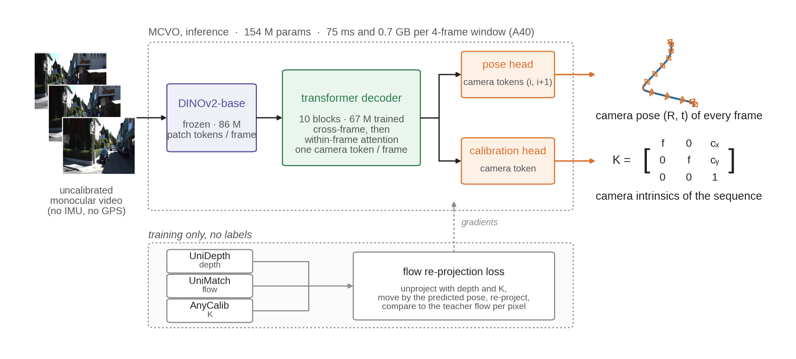
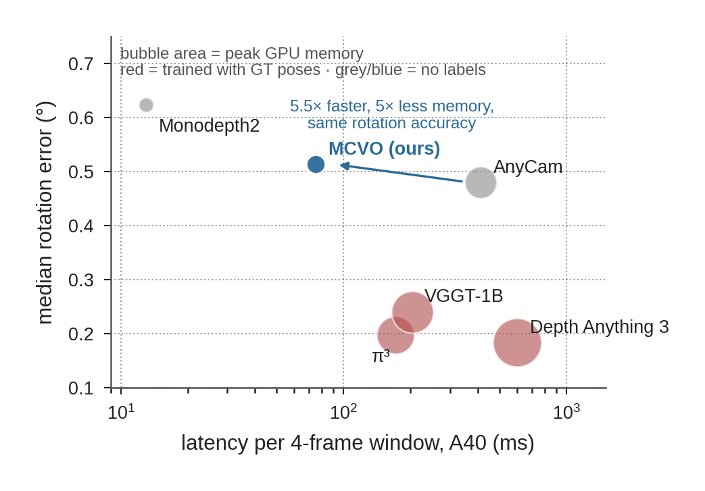
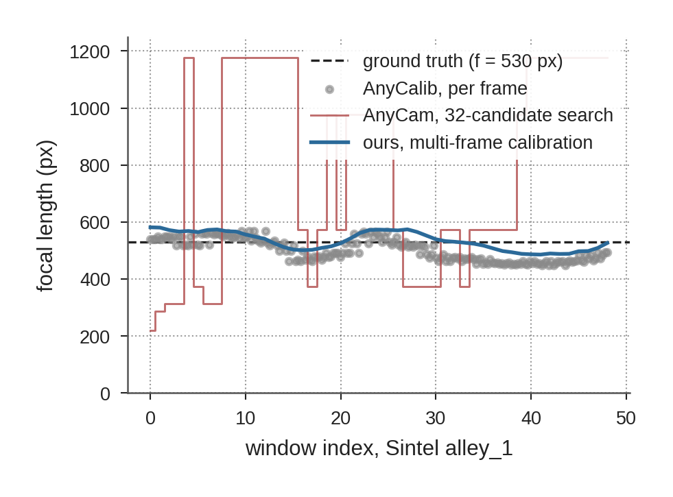

<div align="center">

# MCVO — Multi-frame, Camera-only Visual Odometry

**Camera pose and intrinsics from images alone, trained self-supervised on raw video.**

[Kalman Mahlich](https://github.com/kalman17) · TU Munich, Chair of Computer Vision (Prof. Cremers) · 2026 · weights on [Hugging Face](https://huggingface.co/thekman17/mcvo)

</div>

**MCVO** (*Multi-frame, Camera-only Visual Odometry*) is a small-to-medium-sized transformer trained in a self-supervised fashion. It takes a short window of video frames as input and predicts the relative camera pose between the frames and the intrinsic parameters of the camera for the sequence, in one forward pass. Unlike its predecessor MCT and the original AnyCam model, MCVO operates without a depth network, a flow network or a calibration predictor at test time, which makes it about 5× more efficient in memory and latency than those models at similar pose accuracy. The previous model, **MCT** (*Multi-frame Calibration Transformer*), which came out of my master's thesis, is kept at the bottom of this page — a heavier pipeline with slightly better rotation accuracy indoors and better calibration on driving footage.

<p align="center"><picture><source media="(prefers-color-scheme: dark)" srcset="assets/overview_mcvo_dark.png"></picture></p>
<p align="center"><sub>Inference inside the dotted box; the row below is what supervises it during training — three frozen teacher networks feeding one flow re-projection loss, none of them used at test time. Frames from KITTI 07; the trajectory and K illustrate the two outputs.</sub></p>

## Quick view benchmark

Same protocol for all models: NVIDIA A40, identical 4-frame windows, CUDA-synchronised, clock measured end to end per call, accuracy medians over 16 windows per sequence, no bundle adjustment. Datasets: Sintel, TUM-RGBD, KITTI. Full benchmarks [below](#full-comparison).

| | **MCVO (ours)** | π³ | VGGT-1B | Depth Anything 3 | AnyCam (CVPR'25) | Monodepth2 pose net |
|---|---|---|---|---|---|---|
| Labels for training | **none** | GT | GT | GT | none | none (photometric) |
| Parameters | 154 M | 959 M | 1257 M | 1690 M | 115 M incl. depth & flow nets | 13 M |
| Latency · peak memory (4-frame window) | **75 ms · 0.69 GiB** | 171 ms · 5.5 GiB | 203 ms · 7.0 GiB | 600 ms · 9.7 GiB | 413 ms · 3.7 GiB | 13 ms · 0.09 GiB |
| Rotation error, Sintel / TUM / KITTI | 0.48° / 0.76° / 0.18° | 0.22° / 0.26° / 0.11° | 0.28° / 0.32° / 0.12° | 0.19° / 0.27° / 0.09° | 0.50° / 0.74° / 0.20° | 0.80° / 0.77° / 0.30° |
| Heading error, KITTI (zero-shot for ours) | 5.1° | 2.2° | 4.6° | 1.3° | 28.6° | 1.2° (trained on KITTI) |
| Focal error, Sintel / TUM / KITTI | 31.1 % / 14.3 % / 37.1 % | 25.2 % / 7.6 % / 28.9 % | 34.0 % / 25.8 % / 37.1 % | 24.4 % / 4.6 % / 15.8 % | 70.3 % / 14.6 % / 66.9 % | — (pose only) |

<p align="center"><picture><source media="(prefers-color-scheme: dark)" srcset="assets/benchmark_mcvo_dark.png"></picture></p>
<p align="center"><sub>The same table as a picture: rotation error (mean of the three medians) against latency, bubble area = peak GPU memory.</sub></p>

### Results at a quick glance

- Similar rotation accuracy to AnyCam — the only other self-supervised method in the mix — and better translation direction on driving video (5° vs 29° heading error on KITTI; worse indoors), at 5.5× lower latency and 5× lower memory use.
- Compared to the large, billion-parameter supervised models, MCVO needs 8–14× less peak memory and has 2–8× lower latency, trains with no labels at any stage, and pays for it with roughly twice the rotation error (≈0.5° vs ≈0.25°).
- Compared to the cheapest learned pose model (Monodepth2's pose network), MCVO is heavier and slower (75 ms vs 13 ms) but more accurate in rotation on Sintel and KITTI and equal on TUM. Monodepth2's network is trained per dataset with known intrinsics and cannot predict them; its KITTI heading advantage comes from being trained on KITTI.
- Translation direction is volatile: strong on driving video (5° error on KITTI), weak on small-baseline indoor footage (75° on TUM-RGBD, 104° on Sintel; 90° is chance).
- Intrinsics come from a 1.9 k-parameter head distilled from AnyCalib, the single-frame calibration specialist used as a teacher during training. It adds no cost on top of the pose and gets reasonably close to the teacher: 27.5 % average focal error over the three datasets vs 16.6 % for AnyCalib itself, closest indoors and furthest on KITTI's narrow-FOV crops.

## How MCVO works

**Tokens.** Each 336×336 frame goes through DINOv2-base — the same frozen backbone AnyCam uses, not trained by us — and comes out as a 24×24 grid of *patch tokens* (one vector per 14×14-pixel patch, 768 → 640 dims). To every frame we add one learned **camera token**: a blank vector that carries no image content of its own and whose job is to collect, as it passes through the decoder, what that frame's patches say about the camera.

**Decoder.** 10 identical transformer blocks. Each block does three things in order:

1. *Temporal attention* — every patch position attends to the same position in the other frames of the window. This is where motion is read: how did this part of the image move over time?
2. *Spatial attention* — inside each frame, all patch tokens and the camera token attend to each other. This is where the camera token reads the frame; it takes part only in this step.
3. *Feed-forward MLP* — the standard two-layer MLP that every transformer block applies to every token after attention. It is part of the block, not a head.

After the tenth block the patch tokens hold motion-aware features and each camera token holds a summary of its frame's camera. 67 M parameters are trained (the blocks, the input projection and the heads); the backbone stays frozen.

**Heads.** Three small networks read those tokens:

- *Pose head* — a two-layer MLP on the concatenated camera tokens of frames *i* and *i+1* → translation (3) and rotation as a quaternion (4), i.e. the relative pose cam<sub>i</sub> → cam<sub>i+1</sub>.
- *Calibration head* — one linear layer on each camera token → log focal length and principal-point offset, averaged over the window into one K for the sequence. Trained by distilling the cached AnyCalib intrinsics, head-only, everything else frozen.
- *Uncertainty head* — one linear layer on each patch token → a scalar per patch, upsampled to pixels. As in AnyCam, it is used only inside the loss, where it lets the model discount moving objects and unreliable regions.

**Loss (self-supervised).** No poses, depths or intrinsics are ever given as labels. For each adjacent pair of frames the model's pose is turned into an optical-flow field and compared with the flow a pretrained flow network sees:

$$
\hat f_i(p) = \pi\big(K,\; R_i\,\pi^{-1}(K, p, D_i(p)) + t_i\big) - p
\qquad
\mathcal{L} = \sum_i \sum_p \frac{\big|\hat f_i(p) - f_i(p)\big|}{\sigma_i(p)} + \log \sigma_i(p)
$$

Read left to right: unproject pixel *p* of frame *i* with the teacher depth *D* and intrinsics *K* (π<sup>−1</sup>), move the 3-D point by the predicted rotation *R<sub>i</sub>* and translation *t<sub>i</sub>*, project it back into frame *i+1* (π); the displacement is the flow the pose *implies*. The loss is the L1 distance to the teacher flow *f*, divided by the predicted uncertainty σ, with a log σ penalty so the model cannot escape by calling everything uncertain (a Laplacian negative log-likelihood, the same form AnyCam uses). Three frozen networks supply *D*, *f* and *K* during training — UniDepth, UniMatch and AnyCalib — and none of them is needed once training is done.

**Data.** ~80 k frames of unlabeled video (RealEstate10K, YouTube-VOS, EpicKitchens, WalkingTours) preprocessed once with the AnyCam pipeline; 8-frame clips; 6 epochs on one A40-class GPU.

**Running it.**

```python
import torch
from mcvo.model import MCVO                       # PYTHONPATH=. from the repo root

ck = torch.load("mcvo_e3p_calib.pt", map_location="cpu", weights_only=False)   # from Hugging Face
a = ck["args"]
model = MCVO(backbone=a["backbone"], d_model=a["d_model"], depth=a["depth"], heads=a["heads"]).eval()
model.load_state_dict(ck["model_state_dict"])

out = model(images=frames)      # frames: [1, N, 3, 336, 336], RGB in [0, 1]
out["poses"]                    # [1, N, 1, 4, 4]  relative pose cam_i -> cam_{i+1}; the last one is identity
out["calib"]                    # [1, N, 4]        fx, fy, cx, cy in pixels
```

Training and the benchmark are in [`mcvo/train.py`](mcvo/train.py) and [`experiments/honest_benchmark.py`](experiments/honest_benchmark.py) (the harness behind every number on this page; `--models mcvo:<ckpt>`); the cost benchmark is [`experiments/bench_latency.py`](experiments/bench_latency.py). Environment: `environment.yml`. Reproducing training needs the four raw datasets and the AnyCam preprocessing (`experiments/preprocess_dataset.py`).

**Limitations**

- Translation direction on small-baseline indoor video is weak (near chance on TUM-RGBD and Sintel). Longer context, teacher distillation, an epipolar loss and motion-rich extra data did not change it; fixing the depth convention in the loss (see the changelog) improved it on KITTI and TUM, not on Sintel.
- Intrinsics from the distilled head trail the teacher (27.5 % vs 16.6 % average focal error), most on narrow-FOV driving crops; the head distilled on the previous weights did better on Sintel (21.8 % vs 31.1 %), so the retrained weights carry less focal information for that kind of footage.
- Trajectory-level accuracy trails AnyCam's long-context inference (Sintel ATE 0.29 vs 0.10; TUM-RGBD 0.14): chaining 8-frame windows without bundle adjustment accumulates drift, and the retrained model drifts more on Sintel than the previous one (0.18) despite equal window rotation.
- One training run, one seed; window-level medians without confidence intervals.
- Every number on this page, with its corrections, is dated in [CHANGELOG.md](CHANGELOG.md).

---

## MCT — the thesis model

MCVO grew out of my master's thesis at TUM, whose model is kept here as well. The thesis started from AnyCam, which finds the focal length by testing 32 candidate values through its flow-reprojection loss at every window. The work replaced that search with a calibration predicted directly, AnyCalib-style, and fed into AnyCam's pose head through a learned focal embedding; on top of that, **MCT** (*Multi-frame Calibration Transformer*, 25 M trained parameters) fuses AnyCalib's intermediate features across the frames of a video into one calibration for the sequence instead of averaging per-frame guesses. The result is a pipeline that keeps AnyCam's pose accuracy (rotation 0.40° / 0.67° / 0.23° on Sintel / TUM / KITTI) with calibration at the level of the single-frame specialist (20.7 % / 12.9 % / 20.4 % vs AnyCalib 20.1 / 11.2 / 18.4 %) — at AnyCam's cost, since the depth and flow networks still run at test time (820 ms, 5.0 GiB per 4-frame window). The full write-up, training phases and reproduction commands are in [`docs/thesis.md`](docs/thesis.md); weights at [`thekman17/anycam-mct`](https://huggingface.co/thekman17/anycam-mct).

<p align="center"><picture><source media="(prefers-color-scheme: dark)" srcset="assets/focal_mcvo_dark.png"></picture></p>
<p align="center"><sub>What the multi-frame calibration buys on one sequence (Sintel alley_1, ground truth f = 530 px): the candidate search jumps between discrete focal lengths, per-frame estimates scatter, the multi-frame prediction stays near ground truth.</sub></p>

## Repository layout

```
mcvo/                        # MCVO: model.py, loss.py, train.py, diagnose_teacher_geometry.py
experiments/
├── honest_benchmark.py      # window-protocol benchmark harness (all methods, incl. VGGT / π³ / DA3)
├── bench_latency.py         # controlled latency / memory benchmark
├── calib_bench/             # loaders + motion-observability labels used by the harness
├── models/, train_*.py, ... # MCT and the thesis experiments (see docs/thesis.md)
honest_benchmarks/           # raw per-window rows behind every number on this page
docs/                        # thesis.md (MCT in full), evaluation.md (the protocol)
anycam/ anycalib/ unimatch/  # upstream AnyCam (CVPR 2025), AnyCalib, UniMatch; local patches listed in CHANGELOG.md
minipytorch3d/               # small PyTorch3D subset (as vendored by VGGSfM)
assets/make_figures.py       # regenerates the three figures on this page
CHANGELOG.md                 # every published number and its corrections, dated
```

---

## Full comparison

Rows are metrics, columns are methods. **—** means the method cannot produce that quantity (or it does not apply); **n/m** means not measured here. The first six columns are **measured here** under one protocol: one process per model on the same NVIDIA A40, identical 4-frame windows (20 per model for cost, 16 per sequence for accuracy), CUDA-synchronised, warm-up excluded, end-to-end per call (images in → poses/intrinsics out, including each model's own preprocessing and, for AnyCam, its depth and flow networks). The last four columns are **as reported by their authors** on other hardware and protocols — listed so the picture is complete. Raw: [`honest_benchmarks/latency_summary.json`](honest_benchmarks/latency_summary.json), `experiments/bench_latency.py`, `honest_benchmarks/{e3prime_final_square336,e3p_calibA_square336,trajectories_e3p,thesis_final_e4_square336,S_*,kfix_*}`.

| | **MCVO (ours)** | π³ | VGGT-1B | Depth Anything 3 | AnyCam (CVPR'25) | MCT + AnyCam (thesis) | DPVO* | FVO / VoT* | Monodepth2 pose net | ORB-SLAM3* |
|---|---|---|---|---|---|---|---|---|---|---|
| Measured here | yes | yes | yes | yes | yes | yes | reported | reported | yes | reported |
| Labels for training | **none** | GT poses/depth | GT | GT | none | none | GT poses (TartanAir) | GT poses | none (photometric, KITTI video) | none (classical) |
| Inputs at test time | images | images | images | images | images (+ runs depth & flow nets) | images (+ depth & flow nets) | images + **intrinsics** | images | image pairs | images + **intrinsics** |
| Parameters | **154 M** (67 M trained) | 959 M | 1257 M | 1690 M | 115 M incl. depth & flow nets | 460 M (25 M trained) | n/m (small) | ~500 M | **13 M** | — (not a network) |
| Weights on disk | 0.57 GiB | 3.57 GiB | 4.68 GiB | 6.30 GiB | 0.43 GiB | 1.71 GiB | n/m | n/m | **0.05 GiB** | — |
| Peak GPU memory, 4-frame window | 0.69 GiB | 5.5 GiB | 7.0 GiB | 9.7 GiB | 3.7 GiB | 5.0 GiB | ~4.9 GB (3090, streaming) | not published | **0.09 GiB** | CPU |
| Latency, 4-frame window (A40) | 75 ms | 171 ms | 203 ms | 600 ms | 413 ms | 820 ms | ~60 fps @512×384 (3090); 120 fps variant | "~2× DPVO", "10× 3D foundation models" (3090) | **13 ms** | real-time, CPU |
| Latency, 8-frame window | 132 ms | 300 ms | 376 ms | 1180 ms | 877 ms | 1645 ms | n/m | n/m | **30 ms** | n/m |
| Rotation error, median — Sintel / TUM / KITTI | 0.48° / 0.76° / 0.18° | 0.22° / 0.26° / 0.11° | 0.28° / 0.32° / 0.12° | 0.19° / 0.27° / 0.09° | 0.50° / 0.74° / 0.20° | 0.40° / 0.67° / 0.23° | n/m | n/m | 0.80° / 0.77° / 0.30° | n/m |
| Heading error, KITTI (zero-shot for ours) | 5.1° | 2.2° | 4.6° | 1.3° | 28.6° | 28.2° | n/m | n/m | 1.2° (trained on KITTI) | n/m |
| Heading error — Sintel / TUM | 104° / 75° | 27° / 34° | 38° / 37° | 19° / 32° | 49° / 50° | 47° / 65° | n/m | n/m | 57° / 86° | n/m |
| Focal error — Sintel / TUM / KITTI | 31.1 % / 14.3 % / 37.1 % (distilled head) | 25.2 % / 7.6 % / 28.9 % | 34.0 % / 25.8 % / 37.1 % | 24.4 % / 4.6 % / 15.8 % | 70.3 % / 14.6 % / 66.9 % | 20.7 % / 12.9 % / 20.4 % | — (needs intrinsics as input) | — (pose only) | — (pose only) | — (needs intrinsics as input) |
| Trajectory (Sintel ATE, Sim3; 8-frame windows chained, no BA) | 0.29 | n/m | n/m | n/m | 0.10 | 0.18 | n/m (strong: BA inside) | n/m | n/m | n/m (strong) |
| Source | this repo | [paper](https://arxiv.org/abs/2507.13347) | [paper](https://arxiv.org/abs/2503.11651) | [paper](https://arxiv.org/abs/2511.10647) | [paper](https://arxiv.org/abs/2503.23282) | this repo | [Teed 2023](https://proceedings.neurips.cc/paper_files/paper/2023/file/7ac484b0f1a1719ad5be9aa8c8455fbb-Paper-Conference.pdf) | [Yugay 2025](https://arxiv.org/abs/2510.03348) | measured here, `mono_640x192` weights of [Godard 2019](https://arxiv.org/abs/1806.01260) | [Campos 2021](https://arxiv.org/abs/2007.11898) |

*\* as reported by the authors, not measured here; different GPUs, resolutions and protocols. DPVO: install attempted — its CUDA extension needs `nvcc` (unavailable on our nodes) and the official weight link is dead; FVO: code not released. Monodepth2's pose network is measured on identical windows (pairs resized to its native 640×192). All learned baselines are evaluated at the same 336×336 centre crops MCVO was trained on; native-resolution runs of the large models are in `honest_benchmarks/N_*`.*

---

## Citing this work

For MCVO there is no paper yet; cite the repository:

```bibtex
@misc{mahlich2026mcvo,
  title  = {MCVO: Multi-frame, Camera-only Visual Odometry, self-supervised from raw video},
  author = {Mahlich, Kalman},
  year   = {2026},
  howpublished = {\url{https://github.com/kalman17/mcvo}},
}
```

For MCT, the thesis:

```bibtex
@mastersthesis{mahlich2026learning,
  title  = {Learning Camera Geometry from Unlabeled Real-World Dynamic Video},
  author = {Mahlich, Kalman Eddi},
  school = {Technical University of Munich},
  year   = {2026},
  type   = {Master's Thesis},
}
```

If you use this code, please also cite the upstream **AnyCam** paper:

```bibtex
@inproceedings{wimbauer2025anycam,
  title     = {AnyCam: Learning to Recover Camera Poses and Intrinsics from Casual Videos},
  author    = {Wimbauer, Felix and Chen, Weirong and Muhle, Dominik and Rupprecht, Christian and Cremers, Daniel},
  booktitle = {Proceedings of the IEEE/CVF Conference on Computer Vision and Pattern Recognition},
  year      = {2025}
}
```

---

## Acknowledgements

This work builds directly on **[AnyCam](https://github.com/Brummi/anycam)** (Wimbauer et al., CVPR 2025) and **[AnyCalib](https://arxiv.org/abs/2503.12701)** (Tirado-Garín et al., 2025), and relies on **UniDepth** (Piccinelli et al.) and **UniMatch** (Xu et al.) as frozen helper networks. Supervision by **Daniil Sinitsyn**; thesis examined by **Prof. Dr. Daniel Cremers** at the Technical University of Munich, Chair of Computer Vision & Artificial Intelligence.

<sub>Updated 8 September 2026 — see [CHANGELOG.md](CHANGELOG.md).</sub>
